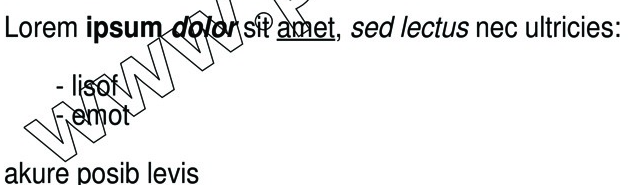

# Html to PDFlib

An extendable library to convert HTML-Content to text 
usable with textflows of [PDFlib](http://pdflib.com)

Original project : [heiglandreas/htmltopdflib](https://github.com/heiglandreas/htmltopdflib)

## Installation

Via [composer](https://getcomposer.org) like this:

```json
{
    "name": "my/project",
    "repositories": [
        {
            "url": "https://github.com/NRCommunication/htmltopdflib.git",
            "type": "vcs"
        }
    ],
    "require": {
        "org_heigl/html-to-pdflib": "0.1"
    },
    "require-dev": {
    }
}
```

## Usage

In your PHP-Code you can use the package like this:

```php
<?php

use Org_Heigl\HtmlToPdflib\Converter as Converter;

$converter = new Converter();

// configure sanitizer
$converter->setAllowedTags([
    '<b>',
    '<i>',
    '<u>',
    '<ul>',
    '<li>'
]);

// building content
$converter->build('Lorem <b>ipsum <i>dolor</i></b> sit <u>amet</u>, <i>sed lectus</i> nec ultricies:<ul><li>lisof</li><li>emot</li></ul>akure posib levis');

// add style rules
$styleProvider = $this->converter->getStyleProvider();

// applying rules
$styleProvider
->applyRule('html', [
    'encoding' => 'utf8',
    'fontname' => 'Helvetica',
    'fontsize' => 11,
    'underline' => 'false',
    'italicangle' => 0
])
->applyRule('b, strong', [
    'fontname' => 'Helvetica-Bold'
])
->applyRule('i', [
    'italicangle' => -12
])
->applyRule('u', [
    'underline' => 'true'
])
->applyRule('ul', [], "\n", "\n\n")
->applyRule('li', [], "\n\t- ");

echo $converter->convert();
```

result: 

```
<macro { 
    m0 { encoding=utf8 fontname=Helvetica fontsize=7 underline=false italicangle=0 } 
    m1 { encoding=utf8 fontname=Helvetica-Bold fontsize=7 underline=false italicangle=0 } 
    m2 { encoding=utf8 fontname=Helvetica-Bold fontsize=7 underline=false italicangle=-12 } 
    m3 { encoding=utf8 fontname=Helvetica fontsize=7 underline=true italicangle=0 } 
    m4 { encoding=utf8 fontname=Helvetica fontsize=7 underline=false italicangle=-12 } 
}><&m0>Lorem <&m1>ipsum <&m2>dolor<&m1><&m0> sit <&m3>amet<&m0>, <&m4>sed lectus<&m0> nec ultricies:<&m0><&m0>
<&m0>
    - lisof<&m0><&m0>
    - emot<&m0>

<&m0>akure posib levis<&m0>
```

after pdf lib process:



## Contributing

Contributions are welcome!

## License

This package is licensed unter the MIT-License.
